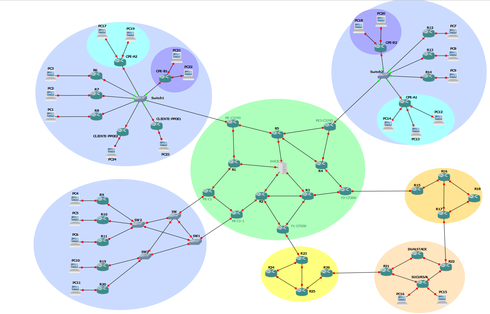

# REDES
El proyecto consiste en dar servicio a distintos ISP y bucles de abonado. Hubo diferentes evoluciones, en las que utilizamos diferentes protocolos de encaminamiento e incorporamos el tráfico ipv6.
Hay un ISP de acceso, el cual tiene implementado tráfico IPV4, BGP, OSPF, MPLS, DHCP, PPOE, y túneles 6RD. Se dispone de dos ISP, uno IPV4 y otro IPV6, que se utilizan para acceder al servicio de Internet. En cada uno de ellos implementamos BGP, OSPF, DHCP y los túneles apropiados según el tipo de tráfico que se necesita encapsular. Los bucles de abonado son los clinetes, teniendo también uno de redundancia para poder aprender a usar IPs secondary.
Por otra parte, creamos también un servicio de VRF-VPN para tener unas tablas de encaminamiento y redes virtuales. La finalidad de implementar esto es hacer creer al usuario (empresas) que tienen conectadas las distintas sucursales entre ellas como si todas estuvieran en el mismo lugar. 
Para el servicio de PPOE escogimos varios clientes, en el mismo bucle de abonado, con distintos LNS y LAC. 

 

